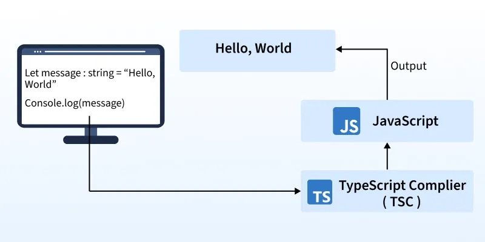
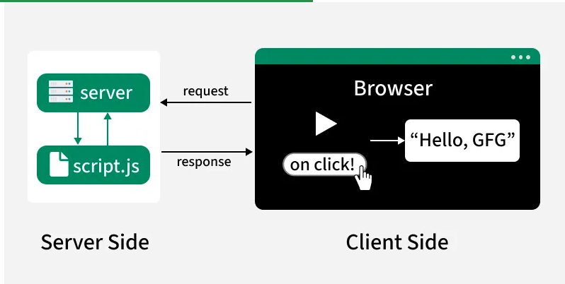

## Ts setup  

- first npm project init 
```sh
 npm init -y 

 ## best way to do 
 npm install --ignore-scripts && npm clean-install


## to install typescript
 npm install -D typescript 


## tsc install 
 npx tsc --init

```

## tsconfig.json mein 
```json
    "rootDir": "./src/",  // yeh ./src folder hain jis mein ts hamse expect kr raha hai k mera sara code esmein hoga or yeh esmein watch krega.
    "outDir": "./dist/",  // yeh folder hona jaruri hai keok ts emmiter jo .js file convert krk dega vo esi folder mein milegi or ese change bhi kr sakte hain or dono folde ka path change kr sakte hain... 

```
 
## how to run ts code 

```sh 

npx tsc 

#using node 
node ./dist/_02_code.js

```

also create script into package json
```json 

  "scripts": {
    "ts_run": "node _02_code.js",
    "tsc-dev": "npx tsc"  
  },

```


# What is Typescript ? 

*TypeScript* is a statically typed superset of JavaScript that compiles to plain JavaScript. It adds features like static typing, interfaces, generics, and modern ECMAScript support, helping developers catch errors early and build scalable applications with better tooling such as autocompletion, refactoring, and debugging.

- It is a compiled language, meaning TypeScript code is first converted into JavaScript before execution.

- Strong typing reduces runtime errors.

- It makes code more predictable, maintainable, and easier to debug.




## Why should I use TypeScript?

- JavaScript is a loosely typed language.

- It can be difficult to understand what types of data are being passed around in JavaScript.

- In JavaScript, function parameters and variables don't have any information!

- So developers need to look at documentation, or guess based on the implementation.

- TypeScript allows specifying the types of data being passed around within the code, and has the ability to report errors when the types don't match.

- For example, TypeScript will report an error when passing a string into a function that expects a number.
JavaScript will not.

## Client Side and Server Side Nature of TypeScript
> TypeScript’s flexibility extends to both the client-side and server-side, allowing developers to create complete, scalable applications. Here’s how it functions in each environment:



### Client-Side:
- Used for controlling the browser and its DOM (Document Object Model).
- Handles user events like clicks, form inputs, and rendering dynamic content.
- Common frameworks and libraries like Angular, React, and Vue offer strong TypeScript support for building - -large-scale front-end applications.

### Server-Side:

- Used for interacting with databases, handling APIs, file manipulation, and generating responses.
- Node.js with TypeScript, along with frameworks like Express or NestJS, is widely used to build type-safe backend applications.
- Type definitions help catch errors early and make server-side code more reliable and maintainable.


---

-  *checkout the js and ts code file and also try your self, !make sure yeh apki first language nhi honi chaahie keoki its based on js so first learn js fir Ts ko learn krna !!.....*